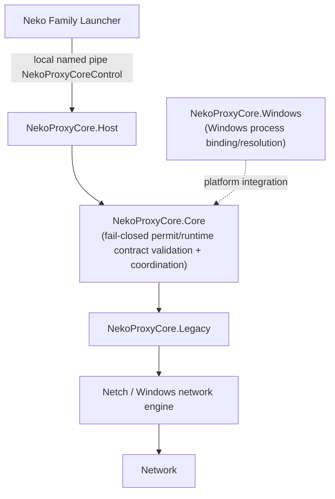

# NekoProxyCore

NekoProxyCore is a transparent proxy routing and traffic redirection core designed for Windows x64 platforms. Built on .NET 6.0 (.NET 6.0.428), NekoProxyCore provides process-level traffic interception, runtime authorization verification, and native redirection engine integration.

---

## Current Status & Verification

- **Integrated Baseline**: `5c31cc5630ce58b8b72d536f1ec3860ba086fd27`
- **Stable Source Parent**: `6ab94bb8fde80a5c675b39b6884c6d31db218dad`
- **Target Platform**: Windows x64 (.NET 6.0.428 SDK/Runtime)
- **Automated Test Coverage**:
  - `Tests/Tests.csproj`: 342 / 342 tests passing (100%)
  - `Tests.Windows/Tests.Windows.csproj`: 94 / 94 tests passing (100%)
  - Combined suite: 436 / 436 verified tests passing

---

## Architecture Overview



*Note: The sibling Control Room project does not communicate directly with NekoProxyCore. Runtime configuration is supplied via the authorized Launcher start path and held for the active session. Core validates authorization under local trust material and public-key authority rather than calling an external cloud backend on each permit.*

---

## Component Map

- **`NekoProxyCore.Core/`**: Runtime contracts, authorization verification, runtime configuration model, and headless coordination/telemetry contracts.
- **`NekoProxyCore.Host/`**: Headless Windows executable and local control/telemetry host.
- **`NekoProxyCore.Windows/`**: Windows process integration and resolution.
- **`NekoProxyCore.Legacy/`**: Adapter into inherited Netch ProcessMode and network engine.
- **`Netch/`**: Inherited legacy Netch engine used by the adapter.
- **`Tests/Tests.csproj`**: Main managed, security, and runtime test suite (342/342 tests passing).
- **`Tests.Windows/Tests.Windows.csproj`**: Windows process and runtime-injection test suite (94/94 tests passing).

---

## Security Principles

- **Fail-Closed Authorization**: Fails closed on missing or invalid authorization. Permits are verified locally under public-key authority.
- **Local Process Binding**: Process communication is bound locally between Neko Family Launcher and NekoProxyCore.
- **Authorized Start Contract**: Fresh authorized start contract delivers runtime configuration directly from Launcher for the active session.
- **Ephemeral Runtime Configuration**: Settings and runtime proxy configurations are kept ephemeral in memory; plaintext proxy configuration is not persisted as a release mechanism.
- **Trust Material Protection**: Secrets, keys, and trust material are strictly shielded and never written to logs or diagnostic output.

---

## Ecosystem Links

- **Launcher**: [https://github.com/Valeneko-pranmong/Neko-Family-Proxy](https://github.com/Valeneko-pranmong/Neko-Family-Proxy) — Desktop client providing local process orchestration and authorized start configuration.
- **Control Room**: [https://github.com/Valeneko-pranmong/Neko-Family-Proxy-admin-tool](https://github.com/Valeneko-pranmong/Neko-Family-Proxy-admin-tool) — Sibling control-plane project for administration and telemetry management (not a direct Core client).

---

## Build and Test

### Prerequisites

- Windows 10/11 x64 or Windows Server 2019/2022 x64
- [.NET 6.0.428 SDK](https://dotnet.microsoft.com/download/dotnet/6.0)
- **Native Prerequisites**: Running `Tests.Windows` requires native `Redirector/bin/Release/Redirector.bin` and `nfapi.dll` build artifacts.

### Build

```powershell
dotnet build NekoProxyCore.Host/NekoProxyCore.Host.csproj -c Release --nologo
```

Native Redirector/RouteHelper components require the Visual Studio C++/MSBuild toolchain and are separate prerequisites for full native packaging/Windows integration.

### Test

```powershell
dotnet test Tests/Tests.csproj -c Release --nologo
dotnet test Tests.Windows/Tests.Windows.csproj -c Release --nologo
```

---

## Upstream Attribution & Licensing

NekoProxyCore incorporates code inherited from the open-source [Netch](https://github.com/netch-x/Netch) project. See the full upstream lineage and attribution details in [`docs/reference/legacy-netch-upstream.md`](docs/reference/legacy-netch-upstream.md).

This project is licensed under the **GNU General Public License v3.0 (GPLv3)**. See [`LICENSE`](LICENSE) for complete terms.
