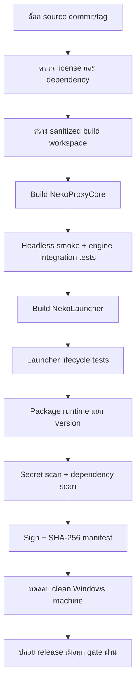

# แผนการสร้าง NekoProxyCore

> **ARCHIVED — 2026-08-05:** แผนเริ่มต้นนี้ถูกแทนที่แล้ว ดูสถานะปัจจุบันที่
> [`../../current/core-release-handoff.md`](../../current/core-release-handoff.md)

สถานะเอกสาร: Historical plan — เริ่มดำเนินการเมื่อ 2026-07-30
ตรวจสถานะล่าสุด: 2026-08-01
เป้าหมาย: แยกส่วน network engine ของ Netch ออกจาก WinForms UI แล้วสร้าง
`NekoProxyCore.exe` แบบไม่แสดง UI สำหรับทำงานเบื้องหลังร่วมกับ NekoLauncher

ผู้รับช่วงงานใหม่ให้เริ่มจาก
[`../../current/core-release-handoff.md`](../../current/core-release-handoff.md)
อ่านรายละเอียด implementation ในเอกสารนี้

## 1. เป้าหมาย

NekoProxyCore ต้อง:

1. ทำงานเป็น process แยกจาก NekoLauncher
2. ไม่สร้างหน้าต่าง WinForms, Console window หรือ System Tray ของ Netch
3. ไม่เรียกใช้หรือเปลี่ยนสถานะหน้าต่างของ NekoLauncher
4. รองรับ profile ของ PSO2 ที่ใช้อยู่ในระบบปัจจุบัน
5. เริ่มทำงานแบบเงียบหลังพบเกม โดยไม่มีโปรแกรมหรือหน้าต่างใหม่เด้งให้ผู้ใช้เห็น
6. ป้องกัน password ระดับพื้นฐาน ไม่เก็บเป็นข้อความอ่านง่ายในไฟล์ runtime
7. มี lifecycle ที่หยุดและเริ่มใหม่ได้ โดยไม่ทิ้ง process ซอมบี้

NekoLauncher ยังคงเป็น UI และ System Tray หลักเพียงตัวเดียวของผลิตภัณฑ์

คำว่า “รันแล้วจบ” ในเอกสารนี้หมายถึง Launcher สั่งเริ่มงานแล้วคืนการควบคุม
ให้ผู้ใช้ทันที โดย NekoProxyCore ยังคงทำงานแบบ hidden process เพื่อให้เกมใช้
proxy ได้ ไม่ได้หมายถึง process ของ engine ต้องจบลงทันทีหลังเปิด

## 2. ขอบเขตปัจจุบัน

Runtime ที่ใช้อยู่ใน repository นี้เป็น Netch `1.9.7.0` และ profile PSO2 ใช้
`ProcessMode`

- Runtime profile ปัจจุบันอยู่ที่
  `F:\Github\Neko-Family-Proxy\ProxyCore\mode\Custom\PSO2.json`
  และไม่ควร commit credential จากไฟล์ runtime นี้
- Launcher process bridge:
  [process_manager.py](https://github.com/Valeneko-pranmong/Neko-Family-Proxy/blob/main/launcher/src/neko_launcher/infrastructure/process_manager.py)
- Netch source tag ที่ใช้เป็นฐาน:
  <https://github.com/netchx/netch/tree/99480e99c3f5f4b0f6c4a32fdbbb4911be2a3687>

การพัฒนาต้องเริ่มจาก source tag เดียวกับ runtime ที่ทดสอบแล้ว ไม่ควรเริ่มจาก
`main` รุ่นใหม่โดยไม่ทำ compatibility review

### 2.1 Repository และ branch ที่ใช้จริง

การพัฒนาแบ่งเป็น 2 repository และต้องไม่เขียน source ของ NekoProxyCore ปะปน
กับ source ของ Launcher:

| งาน | Repository | ตำแหน่งที่แนะนำบนเครื่อง |
|---|---|---|
| Launcher, integration และ packaging | [Valeneko-pranmong/Neko-Family-Proxy](https://github.com/Valeneko-pranmong/Neko-Family-Proxy) | `F:\Github\Neko-Family-Proxy` |
| C# network engine/headless core | [Valeneko-pranmong/NekoProxyCore](https://github.com/Valeneko-pranmong/NekoProxyCore) | `F:\Github\NekoProxyCore` |

Fork `NekoProxyCore` ถูกตรึงจาก Netch 1.9.7 ที่ commit:

```text
99480e99c3f5f4b0f6c4a32fdbbb4911be2a3687
```

Branch บน GitHub ที่สร้างแล้ว:

| Branch | หน้าที่ | กฎการใช้งาน |
|---|---|---|
| [`main`](https://github.com/Valeneko-pranmong/NekoProxyCore/tree/main) | เก็บประวัติ fork/upstream รุ่นใหม่ | ห้ามใช้เป็นฐานของ MVP โดยตรง |
| [`baseline/netch-1.9.7`](https://github.com/Valeneko-pranmong/NekoProxyCore/tree/baseline/netch-1.9.7) | จุดอ้างอิง Netch 1.9.7 เดิม | ห้ามแก้และห้าม commit งานพัฒนา |
| [`feature/neko-headless`](https://github.com/Valeneko-pranmong/NekoProxyCore/tree/feature/neko-headless) | พัฒนา NekoProxyCore แบบ headless | ทุกการเปลี่ยน source ของ core ให้ทำที่นี่ |

วันที่สร้าง branch ทั้ง `baseline/netch-1.9.7` และ `feature/neko-headless`
เริ่มจาก commit เดียวกัน หลังจากนั้น feature branch สามารถมี commit งานเพิ่มได้
แต่ต้องคง `99480e99...` เป็น ancestor เพื่อให้เทียบกับ Netch 1.9.7 เดิมได้
โดยตรง

### 2.2 วิธีเตรียมพื้นที่พัฒนา NekoProxyCore

สถานะ repository ที่ต้องยืนยันด้วย preflight ก่อนเริ่มงาน:

| รายการ | สถานะ |
|---|---|
| Local repository | มีแล้วที่ `F:\Github\NekoProxyCore` |
| Worktree | ต้องสะอาดหรือผู้รับช่วงต้องตรวจและยอมรับไฟล์ที่ค้างทุกไฟล์ |
| Branch ที่ checkout | ต้องเป็น `feature/neko-headless` |
| `origin` | `Valeneko-pranmong/NekoProxyCore` |
| `upstream` | `netchx/netch` |
| Remote baseline | `origin/baseline/netch-1.9.7` ชี้ `99480e99...` |
| Remote development | `origin/feature/neko-headless` ต้องมี `99480e99...` เป็น ancestor |
| Local development branch | `feature/neko-headless` สร้างและ checkout แล้ว |

บนเครื่องนี้ไม่ต้อง clone ซ้ำ เดิม local checkout อยู่ที่ `main`; ตอนนี้สร้าง
local tracking branch จาก remote ที่ตรึงไว้แล้ว:

```powershell
Set-Location F:\Github\NekoProxyCore
git fetch origin --prune
git switch --create feature/neko-headless --track origin/feature/neko-headless
git status -sb
git log -1 --oneline
```

หาก Git แจ้งว่า local branch มีอยู่แล้ว ให้ใช้:

```powershell
git switch feature/neko-headless
git pull --ff-only
```

สำหรับเครื่องใหม่เท่านั้น ให้ clone ใน `F:\Github` ไม่ใช่ภายในโฟลเดอร์
`F:\Github\Neko-Family-Proxy`:

```powershell
Set-Location F:\Github
git clone https://github.com/Valeneko-pranmong/NekoProxyCore.git NekoProxyCore
Set-Location F:\Github\NekoProxyCore

git fetch origin --prune
git switch feature/neko-headless
git status -sb
git log -1 --oneline
```

ก่อนเริ่มแก้ source ครั้งแรก ผลของ `git log -1 --oneline` ต้องขึ้นต้นด้วย:

```text
99480e99 Update UpdateChecker.cs
```

เครื่องปัจจุบันมี `upstream` แล้ว ไม่ต้องเพิ่มซ้ำ สำหรับเครื่องใหม่ให้เพิ่ม
upstream เพื่อใช้ตรวจการเปลี่ยนแปลงจากโครงการต้นฉบับในอนาคต แต่ห้าม merge
`upstream/main` เข้าสู่ branch พัฒนาโดยไม่มี compatibility review:

```powershell
git remote add upstream https://github.com/netchx/netch.git
git fetch upstream --tags
git remote -v
```

หากมี `upstream` อยู่แล้ว ให้ข้ามคำสั่ง `git remote add upstream` และใช้เพียง
`git fetch upstream --tags`

### 2.3 วิธีใช้แต่ละ branch

ตรวจและ build ต้นฉบับ 1.9.7 โดยไม่แก้ไฟล์:

```powershell
Set-Location F:\Github\NekoProxyCore
git switch baseline/netch-1.9.7
git status -sb
git log -1 --oneline

dotnet --info
dotnet restore .\Netch.sln
dotnet build .\Netch.sln -c Release
```

หาก build ตาม solution ต้องการ native dependencies หรือ helper binaries ให้ใช้
build script เดิมหลังติดตั้ง Visual Studio/Windows SDK ตาม dependency ของ Netch:

```powershell
powershell -ExecutionPolicy Bypass -File .\build.ps1
```

เมื่อเก็บผล baseline เรียบร้อยแล้ว ให้กลับไป branch พัฒนาก่อนแก้ source:

```powershell
git switch feature/neko-headless
git status -sb
```

ทุกครั้งก่อน commit ต้องตรวจว่า `git branch --show-current` แสดง
`feature/neko-headless` ห้าม commit บน `baseline/netch-1.9.7`

### 2.4 จุดที่ต้องแก้ในแต่ละ repository

งานใน `F:\Github\NekoProxyCore`:

- เปลี่ยน output เป็น `NekoProxyCore.exe`
- สร้าง `HeadlessHost`
- ตัด dependency จาก `MainForm`, `NotifyIcon`, MessageBox และ balloon
- แยก status/error reporting ออกจาก WinForms
- รักษา `ProcessMode`/PSO2 profile และทดสอบ network engine
- สร้าง core artifact, manifest และ checksum

งานใน `F:\Github\Neko-Family-Proxy` เริ่มหลัง core ทำงานเดี่ยวได้แล้ว:

- ปรับ `process_manager.py` ให้เปิดและตรวจ lifecycle ของ `NekoProxyCore.exe`
- ทำให้ Launcher ไม่ซ่อนหรือควบคุมหน้าต่างด้วย Win32 workaround
- รับ core artifact ที่ผ่านการทดสอบเข้า packaging
- ทดสอบว่า Launcher UI/System Tray ไม่เปลี่ยนสถานะเมื่อเกมเริ่ม
- build `NekoLauncher.exe` หลัง core integration tests ผ่าน

### 2.5 ผลตรวจ source tree และความพร้อมในการ build

ผลตรวจ `F:\Github\NekoProxyCore`:

- baseline 1.9.7 มี tracked files 328 ไฟล์; branch พัฒนาปัจจุบันมี 344 ไฟล์
- มี `Netch.sln`, `build.ps1`, `Netch/Netch.csproj`, `Program.cs`,
  `Global.cs`, `MainController`, `ModeService`, `NFController`,
  `TUNController` และ `PcapController`
- มีไฟล์ runtime ที่ build script ต้องใช้ใน `Storage/` รวมถึง `i18n`, `mode`,
  `stun.txt`, `nfdriver.sys`, `aiodns.conf`, `tun2socks.bin` และ `README.md`
- มี `LICENSE` แต่ยังไม่มี `NOTICE` หรือ `THIRD_PARTY_NOTICES.md`; ต้องสร้าง
  notices ก่อนแจก binary
- `main` ใหม่กว่า baseline 1.9.7 จำนวน 52 commits จึงห้ามนำ `main` มาใช้แทน
  baseline โดยไม่ review

ผลตรวจ source ที่ `origin/baseline/netch-1.9.7` ยืนยันว่าโค้ดยังผูกกับ UI:

- `Program.cs` เรียก `Application.Run(Global.MainForm)` และมี
  `AllocConsole()`
- `MainController`, `NFController`, `TUNController` และ `ModeService`
  เรียก `Global.MainForm`
- `PcapController` สร้างและแสดง `LogForm`
- `Netch.csproj` เป็น `WinExe`, เปิด `UseWindowsForms` และ target
  `net6.0-windows`

สถานะเครื่องมือ build ปัจจุบัน:

| เครื่องมือ | สถานะ | ผลกระทบ |
|---|---|---|
| .NET runtime 6/8 | มี | รันโปรแกรมได้ แต่ใช้ build แทน SDK ไม่ได้ |
| .NET SDK | ไม่มี | `dotnet restore/build/publish` ยังทำไม่ได้ |
| Visual Studio/MSBuild | ไม่พบ | build `Redirector.vcxproj` และ `RouteHelper.vcxproj` ไม่ได้ |
| Visual Studio C++ workload/Windows SDK | ยังไม่ยืนยัน | native x64 projects ยังไม่พร้อม |
| Go toolchain | ไม่มี | build `Other/aiodns` และ `Other/v2ray-sn` ไม่ได้ |

ดังนั้นสถานะปัจจุบันคือ `source checkout verified; baseline build BLOCKED`
ห้ามทำเครื่องหมายว่า Phase 1 build ผ่านจนกว่าจะติดตั้ง dependency และรัน build
จริง

ข้อควรระวังเพิ่มเติม: `build.ps1` ดาวน์โหลด
`GeoLite2-Country.mmdb` จาก GitHub ระหว่าง build จึงยังไม่ใช่ reproducible/offline
build ก่อนทำ release ควรตรึง URL/version/checksum หรือเก็บ dependency ผ่าน
manifest ที่ตรวจ hash ได้

### 2.6 AI preflight tool ก่อนเริ่มงาน

เครื่องมือหลักสำหรับ AI/Codex อยู่ที่:

`tools/neko-proxycore-preflight.ps1`

เครื่องมือนี้อยู่ใน `F:\Github\NekoProxyCore\tools` และตรวจ repository
ที่เป็น parent ของโฟลเดอร์ `tools` โดยอัตโนมัติ หาก AI sandbox ใช้บัญชีคนละตัว
กับเจ้าของ checkout เครื่องมือจะส่ง
`-c safe.directory=<repo>` ให้ Git เฉพาะแต่ละคำสั่ง ไม่เปลี่ยนค่าถาวรของผู้ใช้

รันแบบอ่านง่าย:

```powershell
Set-Location F:\Github\NekoProxyCore
powershell.exe -NoProfile -ExecutionPolicy Bypass `
  -File .\tools\neko-proxycore-preflight.ps1
```

รันแบบ JSON สำหรับให้ AI หรือ CI อ่าน:

```powershell
powershell.exe -NoProfile -ExecutionPolicy Bypass `
  -File .\tools\neko-proxycore-preflight.ps1 `
  -RepoPath F:\Github\NekoProxyCore `
  -AsJson
```

Exit code:

| Code | ความหมาย | การทำงานต่อ |
|---|---|---|
| `0` | ผ่านทั้งหมด | เริ่มงานได้ |
| `2` | ไม่มี blocker แต่มี warning | ตรวจ warning ก่อน build/release |
| `1` | มี requirement ที่ไม่ผ่าน | หยุดก่อนแก้ source หรือ build |

สิ่งที่ tool ตรวจ:

- path และความเป็น Git working tree
- branch ต้องเป็น `feature/neko-headless`
- HEAD และ remote feature ต้องสืบสายจาก commit Netch 1.9.7
- baseline remote ต้องชี้ตรงที่
  `99480e99c3f5f4b0f6c4a32fdbbb4911be2a3687`
- `origin`, `upstream`, tracking state และ worktree changes
- solution, C# source, native projects, driver และไฟล์ runtime ที่จำเป็น
- .NET SDK, MSBuild, Visual C++ workload, Windows SDK และ Go
- Npcap แบบ optional สำหรับ PcapMode
- build-time download ที่ทำให้ build ไม่ reproducible
- ชื่อไฟล์ tracked ที่เสี่ยงเป็น secret, log, dump หรือ private key

เครื่องมือที่ต้องติดตั้งก่อน baseline build:

1. Git for Windows
2. .NET SDK ที่ build `net6.0-windows` ได้ โดย baseline ควรเริ่มจาก SDK
   ที่เข้ากันกับ Netch 1.9.7 และบันทึก version ที่ใช้จริง
3. Visual Studio Build Tools 2022 หรือ Visual Studio 2022 พร้อม:
   - MSBuild
   - Desktop development with C++
   - MSVC x64/x86 build tools
   - Windows 10/11 SDK
4. Go toolchain ที่เข้ากันกับ `Other/aiodns/go.mod` ซึ่งประกาศ `go 1.17`
5. Npcap เฉพาะเมื่อจะ build/test PcapMode; MVP ProcessMode ไม่ควรถูกบล็อกด้วย
   Npcap หากไม่ได้ใช้

Tool ไม่ติดตั้ง dependency อัตโนมัติ ไม่แก้ Git global config ไม่สลับ branch
และไม่แก้ source หน้าที่ของมันคือรายงาน blocker เพื่อให้ผู้ใช้อนุมัติการติดตั้ง
ระดับเครื่องแยกต่างหาก

จำนวน PASS/WARN/FAIL เปลี่ยนตาม branch, worktree และเครื่องมือที่ติดตั้ง จึงห้าม
คัดลอกตัวเลขเก่ามาใช้เป็นหลักฐาน ให้รัน tool ใหม่และเก็บผลจากรอบปัจจุบันเสมอ

Required blockers ที่พบ:

- ไม่มี .NET SDK
- ไม่มี MSBuild/Visual Studio Build Tools
- ไม่พบ Visual C++ workload
- ไม่พบ Windows SDK
- ไม่มี Go toolchain

Warnings ที่ต้องตรวจ:

- worktree changes ต้องมีเจ้าของและขอบเขตชัดเจนก่อนแก้หรือ commit
- ไม่พบ Npcap runtime ซึ่งกระทบเฉพาะ PcapMode
- `build.ps1` ดาวน์โหลด GeoLite2 ระหว่าง build และยังไม่ได้ตรึง checksum

AI ต้องรัน preflight ก่อนเริ่มงานและหลังติดตั้ง dependency ทุกครั้ง ห้ามรายงานว่า
พร้อม build จากการเห็นไฟล์ source ครบเพียงอย่างเดียว

## 3. โครงสร้างเป้าหมาย

```text
NekoLauncher
 ├─ UI + System Tray ของผู้ใช้
 ├─ ตรวจพบ pso2.exe
 └─ เปิด NekoProxyCore.exe
       │
       ├─ Headless Host
       │    ├─ โหลด configuration
       │    ├─ single-instance
       │    ├─ logging ที่ไม่เปิดเผย secret
       │    └─ graceful shutdown
       │
       ├─ Server Transport
       │    └─ V2Ray/SOCKS5/Shadowsocks ตาม license ที่ตรวจแล้ว
       │
       ├─ Traffic Engine
       │    ├─ MVP: ProcessMode/NFController
       │    └─ ทางเลือก: TunMode + tun2socks + WinTUN
       │
       └─ Optional control channel
            └─ ใช้เฉพาะเมื่อจำเป็นต่อ stop/status
```

NekoProxyCore ห้ามมี dependency กลับไปยัง `MainForm`, `NotifyIcon`,
`Application.Run()` หรือ callback ของ Tk/Tkinter

### ประสบการณ์ที่ผู้ใช้ต้องเห็น

```text
เริ่มเกม
 ├─ NekoLauncher ตรวจพบ pso2.exe
 ├─ NekoProxyCore เริ่มแบบ hidden
 ├─ ไม่มีหน้าต่างใหม่
 ├─ ไม่มี Netch tray icon
 ├─ ไม่มี console หรือ balloon notification
 └─ ผู้ใช้เห็นเฉพาะเกมและ NekoLauncher ตามสถานะเดิม
```

## 4. ส่วนประกอบของ engine ที่ต้องแยก

Netch ไม่ได้มี network engine อยู่ในไฟล์เดียว จึงต้องแยกเป็นชั้น:

| ชั้น | Source หลัก | หน้าที่ |
|---|---|---|
| Orchestrator | `MainController` | เริ่ม/หยุด server และ mode controller |
| Server transport | `V2rayController` และ server models | สร้าง local SOCKS5 endpoint |
| Process interception | `NFController` | ดัก traffic ตามชื่อ process |
| TUN interception | `TUNController` | สร้าง adapter และจัดการ route |
| Packet sharing | `PcapController` | ใช้ `pcap2socks` ผ่าน Npcap |
| Mode/config | `ModeService`, mode models | โหลด profile และกฎ bypass/handle |

Source อ้างอิง:

- [MainController.cs](https://raw.githubusercontent.com/netchx/netch/99480e99c3f5f4b0f6c4a32fdbbb4911be2a3687/Netch/Controllers/MainController.cs)
- [NFController.cs](https://raw.githubusercontent.com/netchx/netch/99480e99c3f5f4b0f6c4a32fdbbb4911be2a3687/Netch/Controllers/NFController.cs)
- [TUNController.cs](https://raw.githubusercontent.com/netchx/netch/99480e99c3f5f4b0f6c4a32fdbbb4911be2a3687/Netch/Controllers/TUNController.cs)
- [PcapController.cs](https://raw.githubusercontent.com/netchx/netch/99480e99c3f5f4b0f6c4a32fdbbb4911be2a3687/Netch/Controllers/PcapController.cs)
- [V2rayController.cs](https://raw.githubusercontent.com/netchx/netch/99480e99c3f5f4b0f6c4a32fdbbb4911be2a3687/Netch/Servers/V2ray/V2rayController.cs)

## 5. การเลือก traffic engine

### 5.1 MVP: รักษา ProcessMode ก่อน

เป้าหมายของ MVP คือรักษาพฤติกรรม PSO2 ที่ใช้งานอยู่ให้ได้ก่อน โดยย้าย
`NFController` ไปอยู่หลัง interface เช่น:

```text
ITrafficEngine
 ├─ StartAsync(server, profile)
 ├─ StopAsync()
 └─ HealthAsync()
```

ข้อดี:

- เปลี่ยนพฤติกรรมของ PSO2 น้อยที่สุด
- ใช้ profile เดิมได้
- เปรียบเทียบผลกับ Netch 1.9.7 ได้ง่าย

ข้อควรระวัง:

- ต้องตรวจ license ของ NetFilter SDK
- ต้องติดตั้งและเซ็น `netfilter2.sys`
- ต้องทดสอบสิทธิ์ Administrator และการอัปเดต driver

### 5.2 ทางเลือกที่ควรทำเป็น R&D: TunMode

`TUNController` ใช้ `tun2socks`, WinTUN และ route table แทน NetFilter

ต้องทดสอบ:

- PSO2 TCP และ UDP
- DNS และ bypass server address
- route กลับคืนหลังหยุด
- เกมหรือโปรแกรมอื่นได้รับผลกระทบหรือไม่
- การเปิด/ปิด adapter โดยไม่ทำให้ network ของ Windows ค้าง

หาก TunMode ผ่าน acceptance test ครบ จะเป็น candidate ที่ดีสำหรับ production
เพราะลดการพึ่งพา NetFilter SDK แต่ยังต้องตรวจ license และ code-signing ของ
dependency ทั้งหมด

### 5.3 ไม่ใช้ PcapMode เป็น baseline

PcapMode สร้าง log form ของ Netch และพึ่ง `pcap2socks`/Npcap จึงไม่เหมาะกับ
headless baseline เว้นแต่จะ refactor เพิ่มและยอมรับ dependency ของ Npcap

## 6. แผน refactor จาก UI เป็น headless

### Phase 0: Inventory และ license gate

- [x] Fork source ไปที่ `Valeneko-pranmong/NekoProxyCore`
- [x] ตรึง source เป็น Netch 1.9.7 commit
  `99480e99c3f5f4b0f6c4a32fdbbb4911be2a3687`
- [x] สร้าง `baseline/netch-1.9.7` และ `feature/neko-headless`
- ทำ dependency inventory ของ C# packages, binaries, drivers และ fonts
- ตรวจ GPLv3 ของ Netch
- ตรวจ NetFilter SDK, WinTUN, tun2socks, V2Ray/Xray และ Npcap
- ทำ `THIRD_PARTY_NOTICES.md`
- ตัดสินใจว่าจะใช้ NFController ต่อหรือเปลี่ยนเป็น TunMode

ผลลัพธ์ที่ต้องได้:

- dependency manifest
- license matrix
- decision record ที่ได้รับการอนุมัติก่อนแจก binary

### Phase 1: Fork และ build แบบไม่เปลี่ยนพฤติกรรม

- [x] สร้าง repository แยกชื่อ `NekoProxyCore`
- [x] clone ลง `F:\Github\NekoProxyCore`
- [x] fetch `origin/baseline/netch-1.9.7` และ `origin/feature/neko-headless`
- [x] สร้าง local tracking branch และ checkout `feature/neko-headless`
- [x] เพิ่ม AI preflight tool สำหรับตรวจ environment แบบ human/JSON
- [ ] ติดตั้ง .NET SDK, Visual Studio/MSBuild C++ workload, Windows SDK และ Go
- [ ] build Netch 1.9.7 จาก source โดยยังใช้ UI เดิม
- [ ] ยืนยันว่า runtime และ profile PSO2 ทำงานตรงกับ artifact ปัจจุบัน
- [ ] เก็บ baseline ของ log, ports, driver และ process tree

### Phase 2: แยก application host

- เพิ่ม `HeadlessHost`
- แยก initialization ของ configuration, logging และ engine ออกจาก `Program.Main`
- ห้ามสร้าง `MainForm`
- ห้ามเรียก `Application.Run(Global.MainForm)`
- ห้ามสร้าง `NotifyIcon`
- แทนที่ `Global.MainForm.StatusText()` ด้วย `IRuntimeStatusSink`
- ให้ `ModeService` โหลด mode ได้โดยไม่แตะ UI
- ให้ error กลับเป็น typed result/status แทนการเปิด MessageBox หรือเปิดไฟล์ log

### Phase 3: ทำ control channel แบบเล็กที่สุด

MVP ไม่จำเป็นต้องมี IPC เต็มรูปแบบ หาก NekoLauncher ต้องการเพียงสั่ง start
ครั้งเดียวและหยุดตาม lifecycle ของเกม ให้ใช้ process handle/job object หรือ
control channel ที่เล็กที่สุดก่อน

```text
NekoLauncher
 └─ start NekoProxyCore.exe --profile PSO2
```

หากต้องมี Named Pipe ในภายหลัง ให้จำกัด command ไว้แค่:

- `stop`
- `status`

ไม่ส่ง password ผ่าน command line และไม่เพิ่ม protocol ซับซ้อนจนกว่าจะมี
requirement ที่จำเป็นจริง

### Phase 4: ผูกกับ NekoLauncher

- Launcher เรียก `NekoProxyCore.exe` เฉพาะเมื่อพบ `pso2.exe`
- Launcher ไม่ซ่อน ย่อ ย้าย หรือควบคุมหน้าต่างของ core
- Launcher ไม่เรียก `taskkill` กับ process ที่ผู้ใช้เป็นเจ้าของเอง
- หากเปิดใช้ IPC ให้ Launcher ตรวจ `status`/`health`; หากไม่ใช้ ให้ตรวจจาก
  process handle และ exit code ของ core
- callback ของ System Tray ยังคงทำงานบน UI thread ของ Launcher
- การหยุด core ต้องไม่เรียก Tk methods หรือเปลี่ยนสถานะหน้าต่าง Launcher

นโยบายเริ่มต้นที่แนะนำ:

- เมื่อเกมเริ่ม: start core หนึ่งครั้ง
- เมื่อเกมปิด: stop core แบบ graceful หาก policy เปิดใช้
- หาก stop ไม่สำเร็จ: รายงานสถานะและเก็บ diagnostic ที่ไม่มี secret
- ห้ามทิ้ง mutex, pipe server หรือ child process ค้าง

### Phase 5: Password protection ระดับพื้นฐาน

ขอบเขต security ของ MVP คือป้องกันการเห็น password โดยบังเอิญจากไฟล์
configuration เท่านั้น ไม่ใช่ระบบป้องกัน reverse engineering หรือผู้ใช้ที่มี
สิทธิ์ตรวจ process/memory โดยตั้งใจ

- ไม่เก็บ password เป็น plaintext ใน `settings.json`
- ใช้ Windows DPAPI หรือ encrypted local configuration
- ไม่ส่ง password ผ่าน command line
- ไม่เขียน password ลง log, crash dump หรือ status message
- ยอมรับว่า password ที่ client ต้องใช้ยังสามารถถูกกู้ได้โดยผู้ใช้ที่ตั้งใจแกะ
- ไม่ทำ anti-debugging, obfuscation หรือระบบ secret management ขนาดใหญ่ใน MVP

ก่อนแจกจริงต้องหมุน password เดิมที่เคยอยู่ใน runtime artifact

### Phase 6: Build และ distribution

- build `NekoProxyCore.exe` แยกจาก `NekoLauncher.exe`
- ทำ version และ SHA-256 manifest
- เซ็น executable และ driver ด้วย certificate ที่ถูกต้อง
- รวม source offer/corresponding source ตาม GPLv3 หากใช้ Netch-derived code
- รวม license และ third-party notices ใน installer
- ห้ามรวมไฟล์ development settings ที่มี credential จริง

## 7. แผนทดสอบ

### Unit tests

- profile parser
- mode selection
- state machine
- IPC schema และ timeout
- secret redaction
- single-instance behavior
- graceful stop เมื่อ engine start ล้มเหลว

### Headless smoke tests

- process ทำงานโดยไม่มี top-level window
- ไม่มี Netch tray icon
- ไม่มี console window
- ไม่มี balloon notification หรือหน้าต่างแจ้งเตือนใด ๆ
- เปิดซ้ำแล้วไม่สร้าง process ซ้อน
- stop แล้ว mutex และ child process ถูกคืนครบ

### Engine integration tests

- PSO2 launch detection
- TCP connectivity
- UDP connectivity
- DNS behavior
- bypass/handle rules
- server reconnect
- driver/adapter install และ uninstall
- network recovery หลังหยุด core

### Launcher lifecycle tests

- Launcher ยังมี System Tray หลังเกมเริ่ม
- Launcher ไม่เปลี่ยนสถานะหน้าต่างเอง
- เปิด/ปิด Launcher ซ้ำได้โดยไม่ต้อง restart Windows
- เกมปิดแล้ว Launcher ยังตอบสนอง
- core crash แล้ว Launcher แสดง `FAILED` โดยไม่กลายเป็น zombie

### Release tests

- test บน Windows target ที่ไม่มี development runtime
- test แบบ non-admin และ admin ตามข้อกำหนดจริง
- ตรวจ Authenticode
- ตรวจ SHA-256
- ตรวจ dependency DLL/SYS ครบ
- ตรวจ antivirus false positive และ driver installation
- ตรวจว่าไม่มี UI ของ Netch/NekoProxyCore ปรากฏระหว่างเปิดเกม

## 8. Acceptance criteria

งานจะถือว่าผ่านเมื่อ:

- NekoProxyCore ทำงานได้โดยไม่มีหน้าต่างหรือ tray ของ Netch
- PSO2 ใช้งานผ่าน proxy ได้ทั้ง traffic ที่กำหนดไว้
- NekoLauncher ยังคงมี System Tray และไม่ถูกแตะต้องเมื่อเกมเริ่ม
- ไม่มี NekoLauncher zombie หลัง start/stop/crash/restart
- เปิด Launcher ใหม่ได้โดยไม่ต้อง restart Windows
- ไม่มี password แบบ plaintext ใน source, artifact, log หรือ installer
- มี dependency/license manifest ครบ
- มี corresponding source และ notices ครบตาม license ที่ใช้
- มี signed release artifact และผลทดสอบบนเครื่องเป้าหมาย

## 9. ความเสี่ยงและการตัดสินใจที่ต้องอนุมัติ

| ความเสี่ยง | ผลกระทบ | วิธีลดความเสี่ยง |
|---|---|---|
| Netch core ผูกกับ MainForm | headless build ล้มตอน runtime | แยก status sink และ host layer |
| NetFilter SDK license ไม่ตรงกับรูปแบบแจก | แจก binary/source ไม่ถูกต้อง | license review ก่อนเริ่ม production |
| Driver ไม่ signed หรือถูก Defender block | ผู้ใช้เชื่อมต่อไม่ได้ | code-sign และทดสอบ clean machine |
| TUN route คืนค่าไม่ครบ | network Windows เสียชั่วคราว | route snapshot/rollback และ recovery test |
| Credential อยู่ใน client | ผู้ใช้ดึง password ได้ | encrypted config และไม่เขียนลง log; ไม่ทำ anti-tamper ใน MVP |
| IPC ถูกเรียกจาก process อื่น | สั่ง proxy โดยไม่ได้รับอนุญาต | ใช้ process handle ก่อน; ถ้ามี pipe ให้จำกัด ACL แบบ local user |
| Core crash ระหว่างเกม | เกมหลุด proxy | health monitor และ explicit failure state |

ต้องอนุมัติก่อน implementation production:

1. ใช้ GPL-derived fork ได้หรือไม่
2. มีสิทธิ์แจก NetFilter SDK/driver หรือไม่
3. จะเลือก NFController หรือ TunMode
4. core จะหยุดอัตโนมัติเมื่อเกมปิดหรือไม่
5. รูปแบบการเก็บ password แบบเข้ารหัส; ยังไม่ต้องมี token อายุสั้นหรือระบบ
   secret management ขนาดใหญ่ใน MVP

## 10. Definition of Done

- [ ] Source fork ถูกตรึงที่ commit/tag ที่ตรวจสอบแล้ว
- [ ] Headless host build ได้บน clean environment
- [ ] ไม่มี reference ไปยัง WinForms UI ใน runtime path
- [ ] Hidden-process และ lifecycle tests ผ่าน
- [ ] PSO2 integration test ผ่าน
- [ ] Launcher reopen test ผ่าน
- [ ] Password ไม่อยู่ใน plaintext configuration/log
- [ ] License/dependency review ผ่าน
- [ ] Driver/executable signing ผ่าน
- [ ] Release package มี notices, manifest, checksum และ corresponding source

## 11. Flow สำหรับ build โปรแกรมที่แนะนำ

ส่วนนี้เป็น flow สำหรับนำแผนไปสร้างโปรแกรมจริง โดยแยกการ build ออกเป็น
`NekoProxyCore` และ `NekoLauncher` อย่างชัดเจน ไม่ควรใช้การ copy
`ProxyCore/ProxyCore.exe` ที่มีอยู่ใน repository เป็นหลักฐานว่า headless core
build สำเร็จแล้ว

### 11.1 สถานะและ input ที่ต้องมี

ก่อนเริ่ม build ให้สร้าง release input manifest หนึ่งชุด โดยอย่างน้อยต้องระบุ:

- source repository และ commit/tag ของ Netch fork
- commit ของ `NekoProxyCore` และ `NekoLauncher`
- .NET SDK, Python และ PyInstaller version
- รายชื่อ binary, DLL, SYS, profile และ configuration ที่อนุญาตให้รวม
- license และ checksum ของ third-party dependency แต่ละรายการ
- target Windows build และสิทธิ์ที่ต้องใช้ (standard user หรือ Administrator)
- เอกสาร requirement ที่เป็น source of truth เดียวกันก่อนเริ่ม implementation

ใน checkout ปัจจุบัน `ProxyCore/` เป็น prebuilt runtime ที่แยกจาก source tree
จึงควรถือเป็น **baseline/reference input** เท่านั้น จนกว่าจะมี source fork และ
solution ของ `NekoProxyCore` ที่ตรวจสอบได้ เช่น `NekoProxyCore.sln` และ
project สำหรับ headless host โดยตรง

ควรแก้ความขัดแย้งของเอกสารก่อนเปิด build gate: เอกสารนี้ยึด requirement ว่า
core ต้องทำงานแบบ hidden/headless ขณะที่
`docs/PROXYCORE_HEADLESS_UI_REQUIREMENTS.md` ใน checkout ปัจจุบันอธิบายการเปิด
Netch แบบมองเห็นได้ หากยังไม่เลือกเอกสารหลักให้ชัดเจน ทีมอาจ build artifact ที่
ตรงกันข้ามกับประสบการณ์ผู้ใช้ที่ต้องการ

สถานะที่ควรใช้ใน manifest:

```text
BLOCKED  = ยังไม่มี source หรือ license/dependency gate
PASS     = build และ test ตาม gate ผ่านครบ
FAIL     = ห้ามนำ artifact ไป package/release
WAIVED   = มีผู้อนุมัติยกเว้นเป็นลายลักษณ์อักษร พร้อมเหตุผลและวันหมดอายุ
```

### 11.2 Build flow ระดับ repository



ถ้า gate ใดไม่ผ่าน ให้หยุดที่ gate นั้นและไม่ใช้การ build Launcher ที่ผ่าน
อย่างเดียวมาแทนการยืนยันว่า `NekoProxyCore` ใช้งานได้

### 11.3 Stage A: สร้าง sanitized build workspace

สร้างโฟลเดอร์ staging ใหม่ทุกครั้งจาก source ที่ commit แล้ว ห้าม build จาก
โฟลเดอร์ runtime ที่ผู้ใช้เคยรันจริง โดย workspace ต้อง:

- ไม่มี `settings.json` ที่มี password, token หรือ server credential จริง
- ไม่มี `*.log`, `*.bak`, crash dump หรือไฟล์ profile ส่วนตัว
- ใช้ `settings.template.json` ที่มี placeholder และเติมค่าผ่าน runtime setup
- คัดลอกเฉพาะ binary ที่อยู่ใน dependency manifest และมี checksum ตรงกัน
- แยก output ของ core, launcher และ installer เป็นคนละโฟลเดอร์
- เก็บ source offer และ `THIRD_PARTY_NOTICES.md` ไว้กับ release metadata

จุดนี้สำคัญกับ repository ปัจจุบัน เพราะ `NekoLauncher.spec` มี logic เก็บไฟล์
ทุกไฟล์ใต้ `ProxyCore/` เข้า EXE หากยังใช้วิธีนี้ต่อไป อาจฝัง configuration,
log หรือ binary ที่ไม่ได้ผ่านการอนุมัติลงใน Launcher โดยไม่ตั้งใจ การ build รอบ
ถัดไปควรเปลี่ยนเป็น allow-list ของไฟล์หรือชี้ไปยัง runtime package ที่ผ่าน
การ sanitize แล้วเท่านั้น

### 11.4 Stage B: Build และตรวจ NekoProxyCore

เมื่อมี source fork แล้ว ให้ build core แยกก่อน Launcher:

ตัวอย่าง command contract (ต้องปรับ path ให้ตรงกับ solution จริง):

```powershell
dotnet restore .\NekoProxyCore.sln --locked-mode
dotnet build .\NekoProxyCore.sln -c Release --no-restore
dotnet test .\NekoProxyCore.sln -c Release --no-build
```

1. `restore` dependency ด้วย lock file และ version ที่ระบุใน manifest
2. `build -c Release` โดยปิด UI/console ตาม headless contract
3. วาง output ลงในโฟลเดอร์ versioned เช่น
   `artifacts/NekoProxyCore/<version>/`
4. สร้าง `core-manifest.json` ที่มี file list, version, commit และ SHA-256
5. รัน unit, headless smoke และ engine integration tests
6. ตรวจ process tree, window enumeration, tray และ exit code
7. ตรวจว่า `nfdriver.sys`/adapter/route ถูกติดตั้งและคืนค่าตาม policy จริง

เกณฑ์ขั้นต่ำก่อนส่งต่อให้ Launcher คือ core ต้อง start ได้, อยู่รอดผ่าน startup
stability window, เปิด proxy ตาม PSO2 profile ได้ และ stop แล้วไม่ทิ้ง child
process, mutex, adapter หรือ route ที่ค้างอยู่

### 11.5 Stage C: Build NekoLauncher โดยรับ core package ที่ผ่านแล้ว

Launcher ควรรับ path ของ core package ที่ Stage B สร้างเสร็จแล้ว ไม่ควร
compile ไปพร้อมกับ runtime ที่ไม่ทราบ version:

หลัง core artifact ผ่านแล้ว ค่อยรัน launcher checks และ build ตาม
`BUILD_EXE.md`:

```powershell
Set-Location .\launcher
python -m ruff check src tests
python -m pytest -q -m "not integration"
python -m compileall -q src
python -m PyInstaller --clean --noconfirm NekoLauncher.spec
```

- ตรวจ `core-manifest.json` ก่อน start
- ตรวจ version และ SHA-256 ก่อนเลือก executable
- `launcher/.../process_manager.py` ใน checkout ปัจจุบันยังเปิด ProxyCore
  แบบ visible และปล่อย lifecycle ให้ผู้ใช้จัดการ จึงต้องถือเป็นพฤติกรรม baseline
  คนละแบบกับ headless flow นี้ และห้ามนับเป็น implementation ที่ผ่านแล้ว
- ใช้ runtime แบบ external ใน
  `%LOCALAPPDATA%\NEKO FAMILY\ProxyCore\<version>\` เป็นค่าเริ่มต้น
- ถ้าจะฝังใน one-file EXE ให้ฝังเฉพาะ sanitized allow-list และสร้าง manifest
  ของไฟล์ที่ฝัง
- ไม่ถือสถานะ `RUNNING` จาก `Popen` เพียงอย่างเดียว ต้องตรวจ startup result
  หรือ process handle ตาม contract
- แยก artifact ชัดเจน: `NekoProxyCore.exe`, `NekoLauncher.exe`,
  installer และ checksum ไม่ใช้ชื่อหรือโฟลเดอร์ร่วมกัน

บน CI ควรมี job แยกอย่างน้อย:

```text
core-build      -> core tests -> core artifact
launcher-test   -> launcher tests
launcher-build  -> รับ core artifact ที่ระบุ checksum -> launcher artifact
release         -> sign, manifest, notices, clean-machine evidence
```

ถ้า core artifact ยังไม่พร้อม ให้ job ของ Launcher ทำได้เพียง unit/test build
และต้องระบุว่าเป็น `launcher-only`, ห้ามเรียกว่าเป็น production build ทั้งชุด

### 11.6 Stage D: Package, sign และ install แบบ rollback ได้

แพ็กเกจ release ควรมีโครงสร้างประมาณนี้:

```text
release/
 ├─ NekoLauncher-<version>-Setup.exe
 ├─ NekoProxyCore-<version>.zip
 ├─ core-manifest.json
 ├─ SHA256SUMS.txt
 ├─ THIRD_PARTY_NOTICES.md
 ├─ SOURCE_OFFER.md
 └─ test-evidence/
```

Installer ต้องติดตั้ง core เป็น version directory ใหม่ก่อน แล้วค่อยเปลี่ยน
pointer/current manifest แบบ atomic หาก start หรือ checksum ไม่ผ่าน ให้
rollback ไป version ก่อนหน้าได้ การ uninstall ต้องคืนค่า driver, adapter,
route และ child process ตามที่ติดตั้งโดย release นั้นเท่านั้น

การ sign ต้องทำหลัง package เสร็จและก่อนคำนวณ checksum สุดท้าย โดยตรวจ:

- Authenticode ของ EXE และ kernel driver
- certificate chain และ timestamp
- SHA-256 ของไฟล์ที่ผู้ใช้ดาวน์โหลดจริง
- manifest ไม่เปลี่ยนหลัง sign
- clean Windows machine ที่ไม่มี development runtime

### 11.7 Definition of Build Success

ให้รายงานผล build เป็นราย stage ไม่ใช้คำว่า “สำเร็จ” แบบรวมทั้งหมด:

| Stage | หลักฐานขั้นต่ำ | ผลที่ยอมรับ |
|---|---|---|
| Source | commit/tag และ license matrix | ระบุได้ว่า build จากอะไร |
| Core | core artifact + headless/integration tests | `PASS` เท่านั้นจึงส่งให้ Launcher |
| Launcher | tests + PyInstaller artifact | ยืนยันเฉพาะ Launcher |
| Package | manifest, notices, checksum | ตรวจไฟล์ที่แจกได้ |
| Release | signature + clean-machine evidence | จึงค่อยเรียก production-ready |

ตัวอย่างเช่น build ที่ได้ `NekoLauncher.exe` แต่ core ยังเป็น runtime เดิม,
ยังมี password ใน configuration, หรือยังไม่ได้ทดสอบ driver ให้รายงานเป็น
`launcher artifact built; NekoProxyCore release BLOCKED` ไม่ใช่ release ที่ผ่าน

เอกสารนี้เป็นแผนพัฒนา ยังไม่ได้เปลี่ยน source code หรือ runtime artifact ใด ๆ
