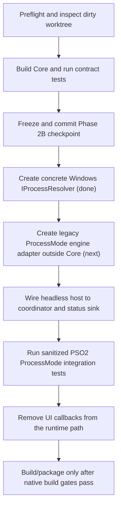

# NekoProxyCore — Phase 2 refactor handoff

อัปเดต: 2026-08-02

เอกสารนี้บันทึก checkpoint ที่ตรวจแล้วสำหรับทีมถัดไปที่แยก runtime/network
engine ออกจาก Netch WinForms เดิม ให้เริ่มจาก [HANDOFF.md](HANDOFF.md) และรักษา
product contract ด้านล่างก่อนเปลี่ยน network behavior

## 1. Snapshot ที่ยืนยันแล้ว

| รายการ | ค่า |
|---|---|
| Workspace | `F:\Github\NekoProxyCore` |
| Branch งาน | `feature/neko-headless` |
| HEAD ปัจจุบัน | `10505d3763a6a5eed8d587b6d3527f8cd495815c` (`10505d3 docs: add NekoProxyCore handoff tooling`) |
| Baseline ที่ pin | `baseline/netch-1.9.7` / `99480e99c3f5f4b0f6c4a32fdbbb4911be2a3687` |
| Remote | `origin=Valeneko-pranmong/NekoProxyCore`, `upstream=netchx/netch` |
| Preflight ล่าสุด | `PASS=34, WARN=3, FAIL=0` |
| Core build | `NekoProxyCore.Core` Release ผ่าน, 0 warnings |
| Contract tests | `dotnet test Tests/Tests.csproj -c Release --no-restore`: 16 passed |
| Windows adapter build | `NekoProxyCore.Windows` Release ผ่าน, 0 warnings |

> สถานะ worktree วันที่ 2026-08-02: มี implementation ของ Step D เพิ่มแล้ว แต่ยัง
> **ไม่ได้ยืนยัน build/test ในเครื่องนี้** เพราะ shell ปัจจุบันไม่พบ .NET SDK/MSBuild.
> หลักฐาน build/test ในตารางข้างต้นเป็นของ checkpoint ก่อน Step D เท่านั้น
> และยังไม่ใช่ PSO2/redirector integration test จริง.

Worktree ใน checkpoint นี้ยังไม่สะอาดโดยตั้งใจ: มี `NekoProxyCore.Core/`,
`NekoProxyCore.Windows/`, `Tests/HeadlessRuntimeTests.cs`, `Netch.sln`,
`Tests/Tests.csproj`, `tools/neko-proxycore-preflight.ps1` และเอกสาร handoff
ที่ยังไม่ commit
ทีมถัดไปต้อง inspect/stage เฉพาะไฟล์ task นี้ และห้าม discard การเปลี่ยนแปลง
ที่มีอยู่

### Tooling ที่ใช้ยืนยัน

| Tool | ผลที่พบ |
|---|---|
| .NET SDK ที่ shell เลือก | `9.0.316`; มี .NET 6 SDK/runtime สำหรับ `net6.0` |
| Core target | `net6.0` (ไม่มี `-windows`, ไม่มี WinForms reference) |
| Visual Studio MSBuild | `17.14.51` |
| Go ที่ preflight พบ | `C:\Program Files\Go\bin\go.exe`, `go1.26.5` |

Go ที่ติดตั้งใหม่เกินรุ่นที่ source `Other/aiodns` เก่ารองรับ (ต้องก่อน 1.20)
ดังนั้น preflight ผ่านเพียงว่า toolchain พบ; ยังไม่ใช่หลักฐานว่า rebuild
`aiodns` ผ่าน

## 2. สิ่งที่เพิ่มใน checkpoint นี้

### 2.1 Core assembly แยกจาก UI

`NekoProxyCore.Core/NekoProxyCore.Core.csproj` เป็น `net6.0` class library ที่ไม่
reference `Netch`, WinForms หรือ native driver โดยตรง โค้ดสำคัญคือ:

| ไฟล์ | หน้าที่ |
|---|---|
| `ProxyConfiguration.cs` | immutable sanitized input: ProcessMode, process/profile/server opaque references และ timeout |
| `ProxyStartRequest.cs` | configuration + safe correlation id + cancellation token |
| `ProxyError*.cs` | error code และ redaction ของ assignment, bearer token, command-line secret และ URI user-info |
| `RuntimeContracts.cs` | `IProxyRuntime`, `IProxyStatusSink`, `IProcessResolver`, `IProxyModeController`, `IProcessModeEngine` |
| `HeadlessRuntimeCoordinator.cs` | state machine: Stopped → Starting → Running → Stopping → Stopped/Failed |
| `ProcessModeController.cs` | seam ที่ตรวจ target process ก่อน/หลัง engine start แล้ว delegate ไป engine adapter |

`ProxyConfiguration` และ correlation id จำกัดเป็น opaque identifier
`[A-Za-z0-9._-]` เพื่อป้องกัน credential/URI หลุดเข้ามาใน status หรือ log
หาก input ไม่ผ่านให้ใช้ `TryCreate(...)` และส่ง `ProxyErrorCode.InvalidConfiguration`
กลับไป ไม่ส่ง exception detail ไปยัง launcher

### 2.2 Contract coverage ที่ผ่าน

`Tests/HeadlessRuntimeTests.cs` ทดสอบด้วย fake process resolver/engine เท่านั้น
ไม่มี profile, server หรือ credential จริง:

- start → running → stop และ typed status events
- repeated stop เป็น idempotent; repeated start คืน `AlreadyRunning`
- process ไม่พบ และ process exit ระหว่าง start คืน typed error
- invalid/secret-like reference คืน `InvalidConfiguration`
- start/stop timeout และ cancellation คืน typed result
- error redaction ไม่คืน sentinel strings
- core assembly ไม่มี `System.Windows.Forms`/`WindowsBase` reference

ใช้ fixture identifier `pso2.exe`, `fixture-pso2`, `fixture-server` เท่านั้น
จึงยัง **ไม่ใช่** การทดสอบ PSO2 จริง, redirector driver จริง หรือ traffic จริง

ตรวจ source ซ้ำได้ด้วย:

```powershell
rg -n 'System\.Windows\.Forms|MainForm|MessageBoxX|NotifyIcon|Application\.Run|BeginInvoke|Invoke\(' `
  .\NekoProxyCore.Core --glob '*.cs' --glob '*.csproj'
```

ผลที่คาด: ไม่มี match

### 2.3 Concrete process resolver ที่เพิ่มในรอบนี้

`NekoProxyCore.Windows/WindowsProcessResolver.cs` เป็น implementation ฝั่ง host
ของ `IProcessResolver` ที่ใช้ `Process.GetProcessesByName` และ `Process.Exited`
โดยไม่สร้าง polling watcher ถาวร ตัว resolver:

- รับเฉพาะ executable name และ normalize `.exe` suffix; path/wildcard ถูกปฏิเสธ
- ตรวจ `HasExited` ก่อนและหลังผูก event เพื่อปิด race ตอน process จบระหว่าง setup
- รอ process ที่อยู่ใน snapshot ด้วย OS process handle/event และรองรับ cancellation
- แปลงความผิดพลาดจาก process inspection เป็น typed `StartFailed` ที่ไม่มีรายละเอียด
  path หรือ command line หลุดออกไป

เพิ่ม test ตรวจการค้นหา process ปัจจุบันทั้งแบบมี/ไม่มี `.exe` และ cancellation
ก่อนรอ ผลรวม contract tests ล่าสุดคือ `16 passed, 0 failed` เมื่อรวม resolver tests

## 3. Product invariants ห้ามละเมิด

- NekoLauncher เป็น UI และ system tray เพียงตัวเดียว
- NekoProxyCore ต้องไม่มี WinForms, console window, tray, balloon หรือ
  notification; ห้ามใช้ window hider, hidden desktop หรือ polling watcher
  เป็น permanent solution
- MVP จำกัดที่ PSO2 ProcessMode; PcapMode/TunMode อยู่นอก scope
- ห้ามเก็บ/ส่ง/เขียน plaintext password, token หรือ private key ใน source,
  profile/fixture, argv, log, dump หรือ artifact
- Core public status/error ต้องเป็น typed/sanitized data ไม่ใช่ UI/localized text
- ห้ามแก้ `baseline/netch-1.9.7`; ห้ามใช้ `main` เป็น compatibility base

## 4. Flow ที่ทีมถัดไปต้องทำ



### Step A — Gate ก่อนแก้

```powershell
Set-Location F:\Github\NekoProxyCore
git status -sb
git merge-base --is-ancestor 99480e99c3f5f4b0f6c4a32fdbbb4911be2a3687 HEAD
if ($LASTEXITCODE -ne 0) { throw 'HEAD is not based on Netch 1.9.7' }

powershell.exe -NoProfile -ExecutionPolicy Bypass `
  -File .\tools\neko-proxycore-preflight.ps1
```

`FAIL>0` คือ stop condition; exit code `2` ที่มี WARN เท่านั้นต้องอ่าน warning
แต่ไม่ใช่ required blocker

### Step B — ยืนยัน checkpoint นี้ก่อนต่อยอด

```powershell
dotnet build .\NekoProxyCore.Core\NekoProxyCore.Core.csproj -c Release --no-restore
dotnet build .\NekoProxyCore.Windows\NekoProxyCore.Windows.csproj -c Release --no-restore
dotnet test .\Tests\Tests.csproj -c Release --no-restore
```

ถ้าจะ commit ให้ stage เฉพาะไฟล์ Phase 2 และเอกสาร handoff ที่ตั้งใจแก้ ห้าม stage
`bin/` หรือ `obj/` (`NekoProxyCore.Core/.gitignore` ป้องกันไว้แล้ว)

### Step C — Concrete process resolver (เสร็จแล้ว)

`NekoProxyCore.Windows/WindowsProcessResolver.cs` implement `IProcessResolver`
นอก Core แล้ว โดยใช้ `Process.GetProcessesByName` และ
`Process.EnableRaisingEvents`/`Exited` พร้อม cancellation, race re-check และ
safe process-name validation ผลทดสอบ resolver อยู่ในชุด `16 passed` ด้านบน

`ProcessModeController` เป็นผู้แปลง process ที่หายระหว่าง startup เป็น
`ProxyErrorCode.ProcessExited`; resolver เองไม่ส่ง path, profile หรือ secret ออกมา

### Step D — Legacy ProcessMode engine adapter

สร้าง adapter ที่ implement `IProcessModeEngine` ใน assembly ที่อนุญาตให้ depend
กับ Netch legacy/native code แล้วค่อย inject เข้า `ProcessModeController`:

- adapter เป็นเจ้าของ mapping จาก safe opaque reference ไปยัง runtime-only
  configuration; อย่าเพิ่ม username/password เข้า `ProxyConfiguration`
- ย้าย status จาก `Global.MainForm.StatusText` เป็น `IProxyStatusSink` ทีละจุด
  เริ่มที่ `Controllers/MainController.cs` และ `Controllers/NFController.cs`
- ให้ stop ใช้ `CancellationToken` และ `ProxyConfiguration.StopTimeout` ที่
  coordinator บังคับใช้อยู่แล้ว
- อย่าแตะ PcapController/TUNController ใน checkpoint เดียวกับ ProcessMode
- adapter/host ต้องไม่สร้าง Form, MessageBox, NotifyIcon หรือ console

สถานะ worktree ปัจจุบันของ Step D:

1. เพิ่ม `NekoProxyCore.Legacy/` ที่ target `net6.0` สำหรับ fake adapter tests และ
   `net6.0-windows` สำหรับ `NetchProcessModeSessionResolver` ซึ่ง reference `Netch`;
   `NekoProxyCore.Core` ไม่ reference กลับหา legacy/Netch
2. `NetchProcessModeEngine` implement `IProcessModeEngine` ผ่าน
   `ILegacyProcessModeSessionResolver`/`ILegacyProcessModeSession`; object ที่อาจมี
   credential ไม่ออกจาก assembly นี้
3. resolver รับเฉพาะ opaque `profile-N` และ `server-N`, ตรวจว่า profile/server/mode
   ProcessMode ใน legacy runtime ตรงกัน ก่อนเรียก `MainController` และ `NFController`
4. `MainController`/`NFController` เปลี่ยน lifecycle status เป็น `IProxyStatusSink`;
   `MainFormProxyStatusSink` เป็น UI adapter ฝั่ง WinForms แยกต่างหาก
5. `HeadlessRuntimeCoordinator` monitor process exit ผ่าน `IProcessExitWatcher` และ
   เรียก stop/cleanup โดยใช้ timeout ของ configuration
6. เพิ่ม fake tests ครอบ typed lifecycle, generic error/redaction, cancelled startup,
   process-exit cleanup และ monitor failure โดยไม่ใช้ PSO2/profile/credential จริง

สิ่งที่ยังห้ามประกาศ: **ยังไม่ยืนยัน** ว่า `ProcessModeController` เริ่ม redirector
หรือส่ง traffic จริงได้ จนกว่าจะผ่าน build/test และ sanitized PSO2 integration test.

### Handoff ให้ทีมถัดไป — ปิด verification ของ Step D ก่อน Step E

1. ติดตั้งหรือเปิด shell ที่มี .NET 6 SDK แล้วรัน `dotnet restore Tests/Tests.csproj`
   ก่อน แล้ว build `NekoProxyCore.Core`, `NekoProxyCore.Legacy` ทั้งสอง target และ
   `Tests/Tests.csproj`
2. ยืนยันว่า legacy Windows target build ได้ใน Visual Studio developer environment
   โดยไม่แก้ PcapController/TUNController เพื่อหลบ build error
3. รัน sanitized PSO2 ProcessMode start → running → stop integration test โดยไม่มี
   credential ใน fixture, argv หรือ log
4. บันทึก command, tool version, test result และ artifact hash ใหม่ก่อนเริ่ม Step E

Stop condition: หากต้องเพิ่ม `Global.MainForm`, WinForms, MessageBox, tray,
console หรือส่ง secret ผ่าน argv/log ให้หยุดและออกแบบ seam ใหม่ก่อน

### Step E — Headless host และ launcher boundary

เมื่อ adapter ผ่าน test แล้วจึงเพิ่ม host executable แยกจาก Netch UI:

- `OutputType=WinExe` โดยไม่เปิด WinForms หรือ console
- รับเฉพาะ opaque profile/server reference ผ่าน IPC หรือ in-process boundary;
  ห้ามส่ง credential ทาง command line
- ส่ง typed status/error/correlation id ที่ผ่าน validation กลับ NekoLauncher
- NekoLauncher เป็นเจ้าของ tray, window, notification, retry และ localization
- อย่าลบ `MainForm` ขนาดใหญ่ครั้งเดียว; ค่อย ๆ ตัด runtime path ออกและคง legacy
  UI adapter จน ProcessMode E2E ผ่าน

## 5. ผล build และ blockers ที่ต้องรายงานต่อ

### แยกความหมายของ `WARN=3`

`WARN=3` จาก preflight ไม่ใช่จำนวน warning ใน compiler output โดยมีความหมาย
คงที่ดังนี้:

1. worktree มีการเปลี่ยนแปลงที่ยังไม่ commit (เป็นสถานะที่ต้อง inspect ไม่ใช่
   required failure)
2. ไม่พบ `wpcap.dll`/`Packet.dll` (ยอมรับได้สำหรับ ProcessMode แต่ block PcapMode)
3. `build.ps1` ดาวน์โหลด GeoLite2 โดยยังไม่มี pinned URL/checksum

จากภาพ `dotnet build .\Netch.sln -c Release` มี warning คนละชุด:

- `NETSDK1138` หนึ่งรายการ: `net6.0-windows` อยู่นอก support policy แล้ว
- `NU1503` สองรายการ: NuGet ข้าม restore ของ `Redirector.vcxproj` และ
  `RouteHelper.vcxproj` เพราะเป็น C++ project

ดังนั้น `3 warning(s)` ในภาพไม่ใช่หลักฐานว่า preflight เปลี่ยนเป็น WARN=6
และไม่ควรกลบ warning ใดด้วยการ suppress ก่อนมีแผน upgrade target framework
หรือ build C++ ที่ถูกต้อง

### ผ่าน

```text
dotnet build NekoProxyCore.Core/NekoProxyCore.Core.csproj -c Release --no-restore
Build succeeded. 0 Warning(s), 0 Error(s)

dotnet build NekoProxyCore.Windows/NekoProxyCore.Windows.csproj -c Release --no-restore
Build succeeded. 0 Warning(s), 0 Error(s)

dotnet test Tests/Tests.csproj -c Release --no-restore
Passed: 16, Failed: 0, Skipped: 0
```

Test project ยังเตือน `SYSLIB0021` จาก `Tests/Global.cs` เดิม (`SHA1CryptoServiceProvider`)
ไม่ใช่ warning ที่เพิ่มจาก Phase 2 core

### ยังไม่ผ่าน — legacy solution build

คำสั่งจากภาพที่ลอง:

```powershell
dotnet build .\Netch.sln -c Release
```

ผลคือ `NekoProxyCore.Core` build สำเร็จ แต่ solution ล้มด้วย `7 error(s)` และ
`3 warning(s)`. Error หลักคือ `MSB4278` ที่หา
`$(VCTargetsPath)\Microsoft.Cpp.Default.props` ไม่พบ

ตรวจซ้ำแล้วไฟล์มีอยู่จริง:

```powershell
Test-Path 'C:\Program Files (x86)\Microsoft Visual Studio\2022\BuildTools\MSBuild\Microsoft\VC\v170\Microsoft.Cpp.Default.props'
# True
```

จึงสรุปได้ว่าเป็น environment/driver mismatch ของ dotnet CLI ไม่ใช่ไฟล์ C++
workload หาย

คำสั่ง Visual Studio MSBuild ที่ลอง:

```powershell
& 'C:\Program Files (x86)\Microsoft Visual Studio\2022\BuildTools\MSBuild\Current\Bin\MSBuild.exe' `
  .\Netch.sln /m /p:Configuration=Release /p:Platform=x64 /verbosity:minimal
```

ผล:

- `RouteHelper.vcxproj` และ `Redirector.vcxproj` สร้าง `RouteHelper.bin` /
  `Redirector.bin` ได้
- Visual Studio MSBuild หา `Microsoft.NET.Sdk` ไม่พบ
- `RedirectorTester` หา reference assemblies ของ `.NETFramework,Version=v4.8`
  ไม่พบ

เมื่อตั้ง `VCTargetsPath` แล้วเรียกผ่าน dotnet SDK จะเปลี่ยนเป็น warning
`MSB8003` (`VCToolsInstallDir` ไม่ถูกกำหนด) และ error `MSB4018`
`CanonicalTrackedOutputFiles` ซึ่งยังยืนยันว่าต้องใช้ Developer environment ของ
Visual Studio/real MSBuild และแก้ managed targeting pack ก่อน

ห้ามแก้ source baseline เพื่อเลี่ยง blocker นี้ และห้ามเรียก output ใด ๆ ว่า release
artifact หรือ reproducible build

### Artifact boundary

มีเพียง development DLL ที่ถูก ignore:
`NekoProxyCore.Core/bin/Release/net6.0/NekoProxyCore.Core.dll` และ
`NekoProxyCore.Windows/bin/Release/net6.0/NekoProxyCore.Windows.dll`
ไม่มี checksum/release manifest

ยังไม่มี `NekoProxyCore.exe`, package, signing, SHA-256 manifest หรือ clean-machine
evidence

## 6. Acceptance checklist สำหรับ handoff รอบหน้า

- [x] Feature branch ยังคงสืบสายจาก pinned baseline
- [x] Preflight ไม่มี required FAIL
- [x] Headless contract start/stop/status tests ผ่านโดยไม่มี UI
- [x] Core assembly ไม่มี WinForms/UI reference
- [x] invalid config, repeated start/stop, process exit, timeout, cancellation และ
  redaction มี typed contract test
- [x] concrete process resolver แบบ event/handle-based
- [ ] legacy ProcessMode adapter source เพิ่มแล้ว; รอ build/test และ sanitized PSO2
  integration test เพื่อยืนยันว่าเรียก redirector จริงโดยไม่พา UI เข้าสู่ core
- [ ] headless host executable และ launcher adapter/IPC
- [ ] sanitized PSO2 ProcessMode start → running → stop integration test จริง
- [ ] ตัด `Global.MainForm` และ UI callback ออกจาก runtime path จริง
- [ ] full native/managed build ผ่าน พร้อม tool versions/artifact SHA-256
- [ ] PcapMode/TunMode (นอก MVP) และ production package/release gates

## 7. Reference inventory ของ legacy UI coupling

จุดที่ยังต้องแยกใน Netch legacy code:

| จุด | งานถัดไป |
|---|---|
| `Netch/Global.cs` | แทน lazy `MainForm` dependency ด้วย injected host/runtime dependencies |
| `Netch/Program.cs` | แยก UI entry point จาก headless host entry point; เอา `Application.Run`, console และ MessageBox ออกจาก core path |
| `Controllers/MainController.cs` | จุดเริ่มต้นย้ายเป็น injected typed status sink แล้ว; runtime path อื่นยังต้องแยกต่อ |
| `Controllers/NFController.cs` | ส่ง driver/lifecycle status ผ่าน sink แล้ว; อย่า log secret |
| `Controllers/TUNController.cs` | ย้าย cancellation/timeout/result เมื่อ ProcessMode track ผ่านแล้ว |
| `Controllers/PcapController.cs` | แยก `LogForm`/`BeginInvoke`; นอก MVP |
| `Services/ModeService.cs` | คืน mode descriptors แทนแก้ ComboBox |
| `Utils/Bandwidth.cs` | ใช้ stoppable telemetry/status publisher |
| `Utils/SubscriptionUtil.cs` | เปลี่ยน NotifyTip เป็น structured event |
| `Utils/Utils.cs` | แยก window activation ออกจาก core path |

ก่อนย้ายแต่ละจุด ให้เพิ่ม/รักษา test แล้วรัน preflight, core build และ tests
